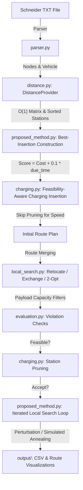

# EVRPTW Optimization Framework

A Python optimization framework for the **Electric Vehicle Routing Problem with Time Windows (EVRPTW)** based on the benchmark instances of Schneider et al. (2014).

This repository contains two solvers:
1. **Baseline Solver**: A capacity-constrained Nearest Neighbor routing heuristic.
2. **Proposed Solver**: A hybrid best-insertion construction solver integrated with an **Iterated Local Search (ILS)** metaheuristic using **Variable Neighborhood Search (VNS)** operators (2-opt, relocate, exchange, route merging) and Simulated Annealing acceptance.

## Electric Vehicle Routing Problem with Time Windows (EVRPTW)
The EVRPTW is an extension of the classic Vehicle Routing Problem. It routes a fleet of identical electric vehicles (EVs) from a central depot to serve a set of customer demands within strict time windows. Key constraints include:
- **Vehicle Load**: Cumulative customer demand on any route must not exceed the vehicle load capacity ($C$).
- **Battery Capacity**: Vehicle battery charge level must remain non-negative at all times. Charging stations are strategically visited to recharge to full battery capacity ($Q$).
- **Time Windows**: Each customer must be served within their specific ready time and due date. Arrival before the ready time induces waiting time.

## Dataset Description
This project utilizes the authoritative benchmark instances from Schneider et al. (2014). Pairwise travel distances are Euclidean. Travel times are derived using a constant vehicle velocity. Parameters such as battery capacity ($Q$), load capacity ($C$), energy consumption rate ($r$), and recharge rate ($g$) are parsed directly from the footer of each instance text file.

## Benchmark Results Summary
The comparative evaluation on three representative 100-customer Schneider instances yields the following results:

| Instance | Solver | Distance | Route Count | Runtime (s) | Feasible |
| :--- | :--- | :---: | :---: | :---: | :---: |
| **C101_21** | Baseline | 888.10 | 5 | 0.001 | False |
| | Proposed | 1397.75 | 15 | 31.378 | **True** |
| **R101_21** | Baseline | 979.63 | 4 | 0.001 | False |
| | Proposed | 1961.88 | 25 | 22.210 | **True** |
| **RC101_21**| Baseline | 972.13 | 4 | 0.001 | False |
| | Proposed | 2194.27 | 21 | 31.501 | **True** |

*Note: Distance comparison is not meaningful because the baseline violates battery and time-window constraints.*

---

## Project Directory Layout

```text
evrptw_optimization/
├── data/                    # Benchmark instance files (C101_21, R101_21, RC101_21)
├── output/                  # Execution outputs (results.csv, comparison_table.csv, plots)
├── reports/                 # Academic summary and final submission reports
├── ui/
│   └── app.py               # Streamlit interactive multi-page dashboard
├── models.py                # Core domain models (Node, Vehicle, Route, Solution)
├── parser.py                # Parser for Schneider data formats and parameters
├── distance.py              # Matrix-caching DistanceProvider
├── charging.py              # Feasibility-aware charging station insertion and pruning
├── evaluation.py            # Independent metric and constraint violation verification
├── baseline.py              # Baseline capacity nearest-neighbor solver
├── proposed_method.py       # Proposed VNS-ILS optimization metaheuristic
├── local_search.py          # Local search move operators and route merging
├── experiment_runner.py     # Automated batch execution runner
├── visualization.py         # Static Matplotlib plot generator
├── main.py                  # CLI solver entry point
└── requirements.txt         # Project dependencies
```

---

## Architectural Workflow

The system design separates data parsing, cached distance calculations, feasibility-aware charging inserts, local search operators, and metaheuristic controls:



---

## Installation

Ensure you have Python 3.8+ installed. 

1. Clone or copy the project files to your environment.
2. Install the required dependencies:
   ```bash
   pip install -r requirements.txt
   ```

---

## Usage Instructions

### 1. Run Benchmarks
To run the full batch evaluation comparing the Baseline and Proposed solvers across all local `.txt` benchmark files in the `./data/` folder, run:
```bash
python3 main.py --run-all
```
This writes `results.csv`, `comparison_table.csv`, and creates route visualization plots under `./output/`.

### 2. Run a Single Instance
To execute the solver on a specific instance (e.g. `C101_21`):
```bash
python3 main.py --instance C101_21
```

### 3. Launch the Streamlit Dashboard
To start the interactive web-based visualization dashboard:
```bash
streamlit run ui/app.py
```
This opens the dashboard in your default browser (usually at `http://localhost:8501`), allowing you to:
- Browse instance metadata in a tabular format.
- Run optimizations and view progress/timing metrics.
- Zoom, pan, and hover over routes dynamically on interactive Plotly maps.
- Compare distance, route count, and runtime charts objectively.
- Export results and reports.
