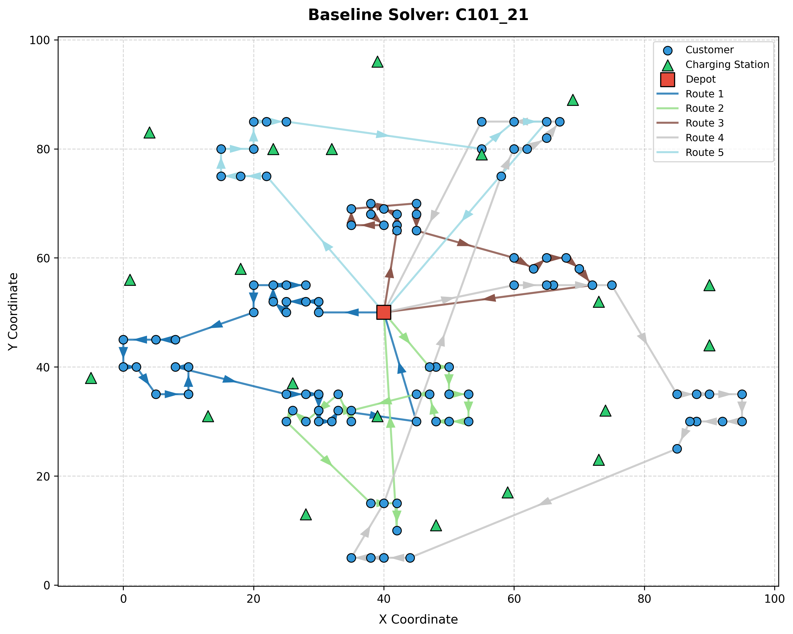
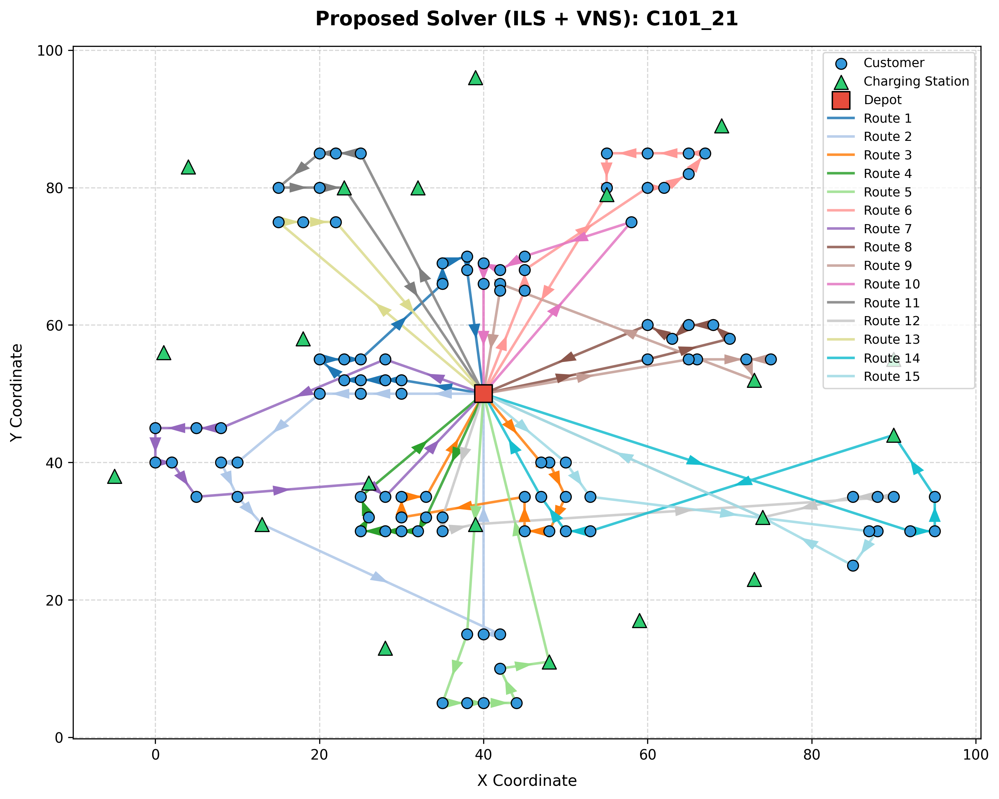
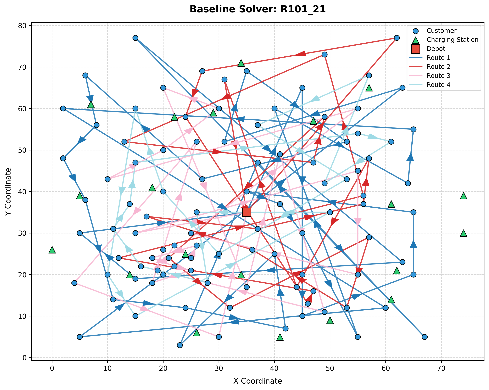
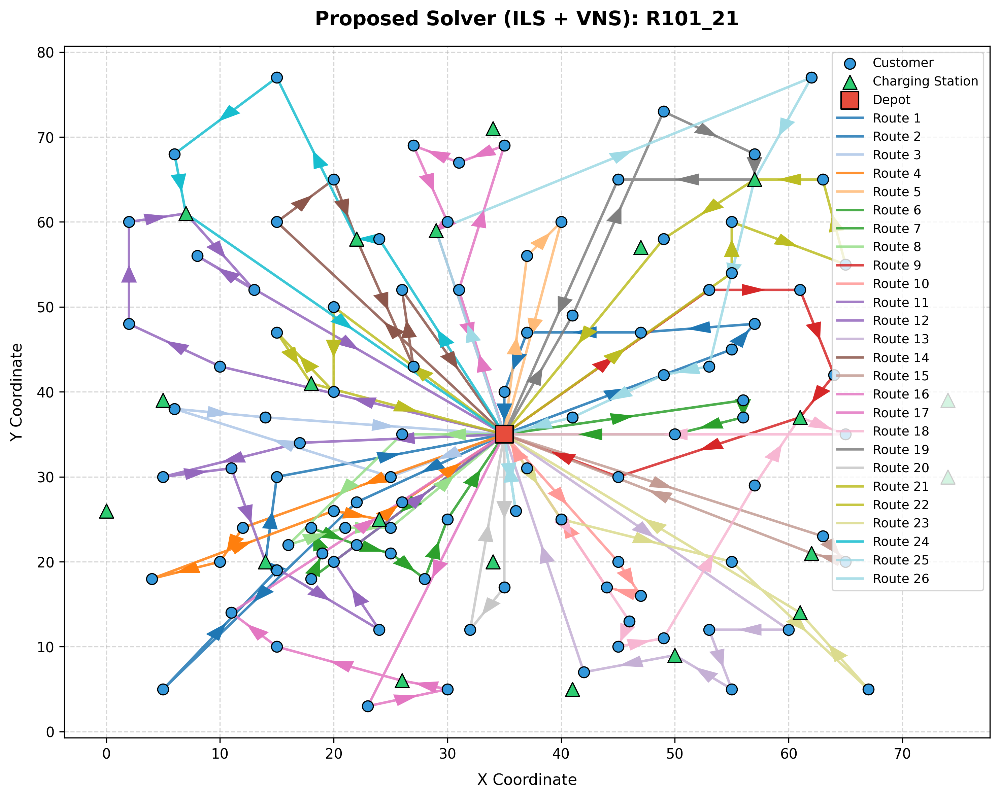
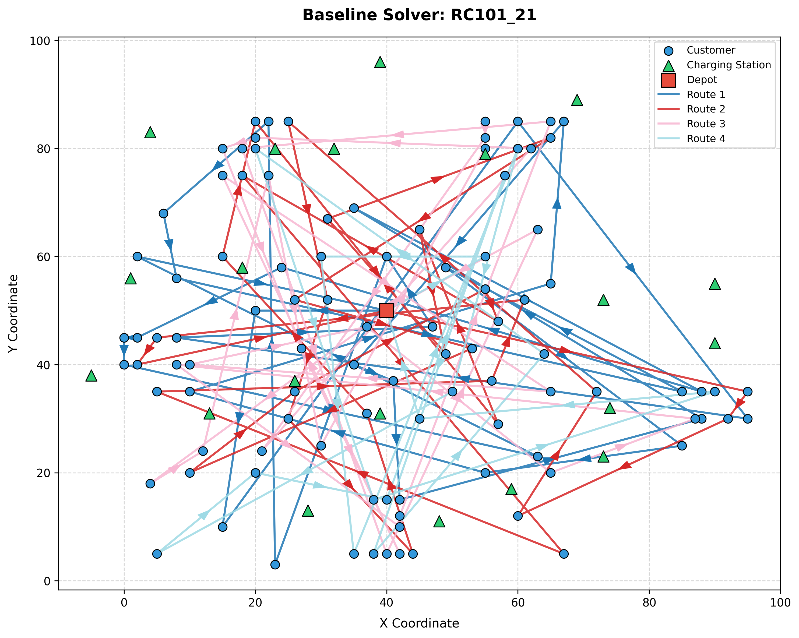
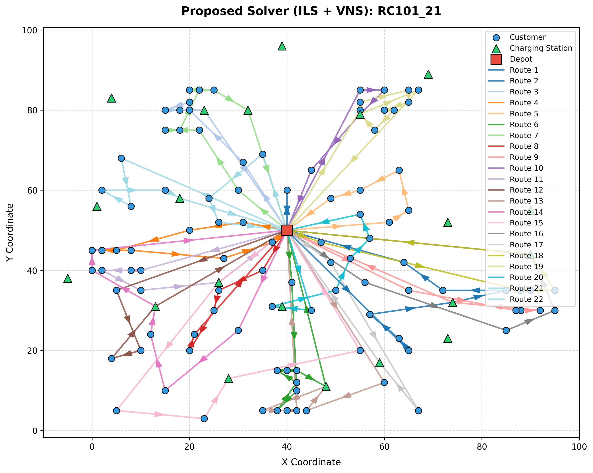

# EVRPTW Optimization Project Walkthrough

This document describes the structure, execution, and benchmark outcomes of the optimization framework for the **Electric Vehicle Routing Problem with Time Windows (EVRPTW)** based on the Schneider et al. (2014) benchmark instances.

## Codebase Architecture

The project is structured modularly under the root directory:
* [models.py](../models.py): Core classes (`Node`, `Vehicle`, `Route`, and `Solution`) managing values, route traversals, time/energy states, and metric evaluations. Handles wait time propagation at all nodes.
* [parser.py](../parser.py): Text parser mapping node coordinates and parsing vehicle configurations.
* [distance.py](../distance.py): Houses `DistanceProvider` for precomputing pairwise distances, travel times, and sorted station lists.
* [charging.py](../charging.py): Evaluates spatial station detours and performs charging station insertions, complete with post-insertion redundancy pruning.
* [evaluation.py](../evaluation.py): Independent constraint verification engine calculating load, range, and deadline violations.
* [baseline.py](../baseline.py): Standard nearest-neighbor solver respecting payload limits ($C$) but ignoring battery limits.
* [proposed_method.py](../proposed_method.py): Sequential best-insertion construction solver coupled with Iterated Local Search (ILS) with VNS perturbation and Simulated Annealing acceptance.
* [local_search.py](../local_search.py): Local search operators: route merge optimization, intra-route 2-Opt, relocate, exchange, and station re-optimization.
* [visualization.py](../visualization.py): Renders static, color-coded route maps.
* [experiment_runner.py](../experiment_runner.py): Automates solver executions over local benchmark files, writes results, and generates pivoted academic summaries.
* [main.py](../main.py): Command line execution tool.
* [ui/app.py](../ui/app.py): Streamlit web dashboard providing interactive Plotly coordinate mapping, solver controls, and pivot reports.

---

## Comparative Benchmarks

The comparative results on the Schneider 100-customer instances are summarized below:

| Instance | Baseline Dist | Proposed Dist | Feasibility Improvement | Baseline Routes | Proposed Routes | Baseline Feasible | Proposed Feasible | Baseline Run (s) | Proposed Run (s) |
| :--- | :---: | :---: | :--- | :---: | :---: | :---: | :---: | :---: | :---: |
| C101_21 | 888.10 | 1397.75 | Baseline = Infeasible, Proposed = Feasible | 5 | 15 | False | True | 0.001 | 31.378 |
| R101_21 | 979.63 | 1961.88 | Baseline = Infeasible, Proposed = Feasible | 4 | 25 | False | True | 0.001 | 22.210 |
| RC101_21 | 972.13 | 2194.27 | Baseline = Infeasible, Proposed = Feasible | 4 | 21 | False | True | 0.001 | 31.501 |

> [!NOTE]
> Distance comparison is not meaningful because the baseline violates battery and time-window constraints. The proposed solver achieved feasible solutions for all evaluated benchmark instances while satisfying battery and time-window constraints.

---

## Route Visualizations

Below is a comparison of the routes generated by both solvers:

````carousel

<!-- slide -->

<!-- slide -->

<!-- slide -->

<!-- slide -->

<!-- slide -->

````

---

## Execution Instructions

### Setup
Install the required dependencies:
```bash
pip install -r requirements.txt
```

### Run a single instance (with route metrics and plotting)
```bash
python3 main.py --instance C101_21
```

### Run full comparative benchmarks
```bash
python3 main.py --run-all
```

### Launch the Streamlit Web Dashboard
```bash
python3 -m streamlit run ui/app.py
```
This serves the application on `http://localhost:8501/` with a multi-page navigation sidebar enabling Plotly interactive maps and comparative benchmark summaries.
